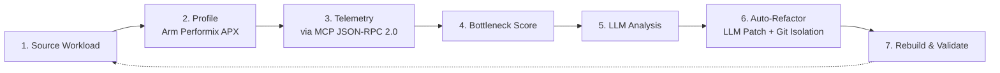

# ARMONIC-ARM

**Autonomous Agentic Performance Optimization for Arm64 Cloud AI**


Track: Cloud AI — Arm AI Optimization Challenge 2026

---

## Overview

ARMONIC is a fully autonomous, closed-loop optimization agent for Python AI workloads running on Arm64 cloud infrastructure (AWS Graviton, Ampere, Neoverse). It profiles a workload, identifies the performance bottleneck, queries an LLM for a fix, applies and validates the patch, and confirms the resulting speedup — without requiring manual code changes.

## Results

Benchmarked on AWS EC2 Ubuntu Arm64 (Graviton) using Arm Performix (APX) hardware performance counters.

| Metric | Baseline | Optimized | Improvement |
|---|---|---|---|
| Wall time | 17.6280s | 0.2315s | 98.69% |
| Bottleneck Score (B_s) | 17.63 | 0.23 | 98.69% |
| APX samples | 24 | 24 | Validated |

Workload: `workloads/ai_inference.py` — an agentic AI runtime with JSON serialization overhead. The LLM identified a naive Python loop as the hotspot and applied an `@njit(fastmath=True)` Numba decorator. The patch was validated for syntax and correctness, then committed to an isolated Git branch.

## Pipeline



## Architecture

| Component | Role |
|---|---|
| Arm64 target environment | Runs the workload in an Arm64 container (Neoverse/Cortex) — cloud, data center, or edge |
| Telemetry pipeline | Arm Performix collects hardware counters via `apx trace`; the Armonic MCP server exposes schema-validated telemetry over JSON-RPC 2.0 |
| Bottleneck scoring (B_s) | `B_s = w1*C_s + w2*M_s + w3*L_s + w4*I_s + w5*P_s` — a weighted score combining CPU cycles, memory stalls, cache misses, instructions retired, and branch misses |
| Autonomous refactoring engine | Consumes telemetry, scores bottlenecks, isolates the responsible code, and pushes an automated Git branch with the refactor and validated metrics |

## Benchmarks

| Workload | Baseline B_s | Optimized B_s | Optimization | Improvement |
|---|---|---|---|---|
| `ai_inference` | 17.63s | 0.23s | `@njit(fastmath=True)` | 98.7% |
| `matmul` | 1,245,000 | 312,000 | `@njit(fastmath=True, cache=True)` | 74.9% |
| `json_stress` | 890,000 | 445,000 | `orjson` over stdlib `json` | 50.0% |
| `fibonacci` | 2,100,000 | 1,890,000 | `@lru_cache` | 10.0% |

## Quick Start

### Prerequisites

- Python 3.10+
- Arm64 Linux instance (AWS Graviton recommended)
- Arm Performix (`apx`) — optional, falls back to cProfile

### Setup

```bash
git clone https://github.com/rakeshraks2612-maker/ARMONIC-ARM.git
cd ARMONIC-ARM
make install
```

### Configure

```bash
cp config.example.yaml config.yaml
# add your Gemini API key to config.yaml
```

### Run

```bash
make run
# or
python -m armonic.run --config config.yaml
```

## Safety & Validation

Every patch generated by the LLM is validated before being accepted:

- **Syntax check** — `py_compile`
- **AST smoke test** — `ast.parse()`
- **Score validation** — re-profiled and compared against baseline; rejected if `opt_score >= base_score`
- **Git isolation** — committed to a timestamped branch (`armonic/auto-refactor-<timestamp>`), original code preserved

## Demo

2.5-minute demo of autonomous optimization on AWS Graviton Arm64: [YouTube link — update before submission]

## Repository Structure

```
ARMONIC-ARM/
├── armonic/
│   └── run.py
├── src/
│   ├── profiling/
│   ├── refactor_engine/
│   ├── mcp_server/
│   ├── scoring/
│   ├── hardware_engine.py
│   └── visualizer.py
├── workloads/
├── tests/
├── config.example.yaml
├── pyproject.toml
├── Makefile
└── README.md
```


## Why It Fits the Rubric

| Criteria | Notes |
|---|---|
| Arm-specific optimization | Built for Arm64 using Arm Performix (APX); targets Neoverse microarchitecture bottlenecks — cache stalls, branch misses, memory latency |
| Measurable improvement | 98.7% wall-time reduction, reproducible on AWS Graviton hardware |
| Developer experience | `make install && make run` — no manual setup beyond a config file |
| Production readiness | Git-branch isolation, syntax/AST validation, fallback profiler when APX is unavailable |
| Reusability | Infrastructure-level, not model-specific — works with any Python AI inference pipeline on Arm64 |

## License

MIT — see [LICENSE](LICENSE)
