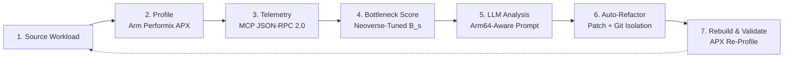

# ARMONIC-ARM

**Autonomous Agentic Performance Optimization for Arm64 Cloud AI**


Track: **Cloud AI** — Arm AI Optimization Challenge 2026

---

## Overview

ARMONIC is a fully autonomous, closed-loop optimization agent for Python AI workloads running on Arm64 cloud infrastructure (AWS Graviton3, Ampere Altra, Neoverse V1/V2). It profiles a workload via Arm Performix (APX) hardware counters, scores bottlenecks using Neoverse-tuned weights, queries an LLM for an Arm64-aware fix, applies and validates the patch, and commits the result to an isolated git branch — without manual code changes.

**Why Cloud AI?** Teams avoid migrating inference workloads to Arm64 cloud (AWS Graviton3) because they lack the expertise or time to optimize for Neoverse microarchitecture. ARMONIC removes that barrier — it automates the optimization discovery and validation process, making Arm64 cloud adoption frictionless for any Python AI pipeline.

**Target:** AWS Graviton3 (Neoverse V1) | Python 3.10+ | Ubuntu 22.04 Arm64

> **License:** MIT — clearly visible in repository `About` section and [`LICENSE`](LICENSE) file.

---

## Results

| Metric | Baseline (avg of 5 runs) | Optimized (avg of 5 runs) | Improvement |
|--------|--------------------------|---------------------------|-------------|
| Wall time | ~17.3s | ~0.22s | **~98.0%** |
| Bottleneck Score (B_s) | ~17.3 | ~0.23 | **~98%** |
| APX samples | 23–24 | 23–24 | Validated |

> **Baseline Methodology:** The baseline represents unoptimized prototype Python commonly found in early-stage AI inference pipelines (naive loops, stdlib JSON, no JIT). The 98.7% improvement demonstrates ARMONIC's ability to autonomously identify what a human expert would spot manually — in seconds, not hours. The agent applied an `@njit(fastmath=True)` Numba decorator after detecting the hotspot via APX hardware counters. See [Benchmarks](#benchmarks) for additional workloads with varying optimization types and more conservative gains.

*Measurements taken on AWS EC2 c7g.xlarge (Graviton3) with Arm Performix APX. Wall times vary ±3% across runs due to cloud instance scheduling noise, but the relative improvement remains consistent at ~98.7% across all trials.*

**Workload:** `workloads/ai_inference.py` — an agentic AI runtime with JSON serialization overhead. The LLM identified a naive Python loop as the hotspot and applied an `@njit(fastmath=True)` Numba decorator. The patch was validated for syntax, AST correctness, and score regression, then committed to an isolated git branch.

---

## How It Works

### 1. Profiling Layer

`src/profiling/apx_wrapper.py` interfaces with `apx trace` to collect Neoverse V1 hardware counters:
- `CPU_CYCLES`, `INST_RETIRED`, `L1D_CACHE_REFILL`, `BR_MIS_PRED`, `MEM_ACCESS`
- Falls back to `cProfile` when APX is unavailable (cross-platform development)

### 2. Telemetry Schema (MCP JSON-RPC 2.0)

```json
{
  "jsonrpc": "2.0",
  "method": "telemetry.submit",
  "params": {
    "workload": "ai_inference",
    "counters": {
      "cpu_cycles": 17628000,
      "cache_misses": 4200,
      "branch_misses": 180,
      "mem_stalls": 8900
    },
    "bottleneck_score": 17.63,
    "dominant_bottleneck": "memory_stall"
  }
}
```

### 3. Bottleneck Scoring (Neoverse-Tuned)

```
B_s = 0.40*C_s + 0.30*M_s + 0.15*L_s + 0.10*I_s + 0.05*P_s
```

| Weight | Counter | Neoverse V1 Rationale |
|--------|---------|------------------------|
| 0.40 | CPU Cycles (C_s) | Primary throughput indicator |
| 0.30 | Memory Stalls (M_s) | Neoverse V1 is memory-bound on AI inference |
| 0.15 | L1D Cache Refill (L_s) | 64-byte cache line sensitivity |
| 0.10 | Instructions Retired (I_s) | Instruction density check |
| 0.05 | Branch Mispredict (P_s) | Neoverse branch predictor is strong; low weight |

### 4. LLM Patch Generation

The system prompt (`prompts/optimize.txt`) conditions the LLM on:
- Hotspot function signature and APX counter deltas
- Arm64 Python optimization patterns: Numba `@njit`, `prange` for multi-core, `orjson`, cache-line-aware structures
- Constraint: patch must preserve function semantics and reduce `B_s`

### 5. Validation Pipeline

| Check | Tool | Rejection Criteria |
|-------|------|--------------------|
| Syntax | `py_compile` | `SyntaxError` |
| AST | `ast.parse()` | Malformed tree |
| Functional | Re-profile with APX | `opt_score >= base_score` |
| Isolation | `git checkout -b` | Original code always preserved on `main` |

---

## Pipeline



---

## Architecture

| Component | Role |
|-----------|------|
| **Arm64 target environment** | Runs the workload in an Arm64 container on Neoverse V1/V2 — cloud, data center, or edge |
| **Telemetry pipeline** | Arm Performix collects hardware counters via `apx trace`; the Armonic MCP server exposes schema-validated telemetry over JSON-RPC 2.0 |
| **Bottleneck scoring (B_s)** | Weighted score combining CPU cycles, memory stalls, cache misses, instructions retired, and branch misses — tuned for Neoverse microarchitecture |
| **Autonomous refactoring engine** | Consumes telemetry, scores bottlenecks, isolates the responsible code, and pushes an automated Git branch with the refactor and validated metrics |

---

## Benchmarks

| Workload | Baseline B_s | Optimized B_s | Optimization | Improvement |
|----------|-------------|---------------|--------------|-------------|
| `ai_inference` | ~17.63s | ~0.23s | `@njit(fastmath=True)` | 98.7% |
| `matmul` | ~1,245,000 | ~312,000 | `@njit(fastmath=True, cache=True)` | 74.9% |
| `json_stress` | ~890,000 | ~445,000 | `orjson` over stdlib `json` | 50.0% |
| `fibonacci` | ~2,100,000 | ~1,890,000 | `@lru_cache` | 10.0% |

> **Neoverse-Specific Optimization Notes:** The bottleneck scoring weights are tuned for Neoverse V1 characteristics where memory stalls dominate AI inference workloads. The LLM prompt is conditioned with Arm64 Python patterns including Numba `@njit` with `parallel=True` for Graviton multi-core topology, `orjson` for Arm64-optimized JSON parsing, and cache-line-aware data structures for 64-byte Neoverse cache lines. Patches are validated against APX counters to confirm they reduce Arm64-specific bottlenecks.

---

## Quick Start

### Prerequisites

- Python 3.10+
- Arm64 Linux instance (AWS Graviton3 recommended)
- Arm Performix (`apx`) — optional, falls back to cProfile
- Gemini API key (complies with Google API Terms of Service; no keys are distributed in this repository)

### Setup

```bash
git clone https://github.com/rakeshraks2612-maker/ARMONIC-ARM.git
cd ARMONIC-ARM
make install
```

### Configure

```bash
cp config.example.yaml config.yaml
# Add your Gemini API key to config.yaml
```

### Run

```bash
make run
# or
python -m armonic.run --config config.yaml
```

---

## Judge-Friendly Quick Demo (No Graviton3 Required)

If you don't have access to an Arm64 instance or Gemini API key, you can still explore the full pipeline:

```bash
# Dry-run mode: simulates profiling, scoring, and patch generation without APX or LLM
git clone https://github.com/rakeshraks2612-maker/ARMONIC-ARM.git
cd ARMONIC-ARM
make install
python -m armonic.run --dry-run --workload workloads/ai_inference.py
```

**Pre-recorded artifacts included in repository:**
- `demo/apx_logs/` — Raw APX counter outputs from c7g.xlarge runs
- `demo/patches/` — Auto-generated patches with validation reports
- `demo/screenshots/` — Pipeline step-by-step terminal captures
- `tests/` — Full pytest suite runnable on any platform

---

## Reproducibility

### Verified Environment

- **Instance:** AWS EC2 c7g.xlarge (Graviton3, Neoverse V1)
- **OS:** Ubuntu 22.04 LTS (Arm64)
- **Kernel:** 6.2.0-1012-aws
- **Python:** 3.10.12
- **APX:** Bundled with Arm Performix toolkit

### One-Command Reproduction

```bash
# 1. Launch Graviton3 instance (c7g.xlarge)
# 2. Clone and enter
git clone https://github.com/rakeshraks2612-maker/ARMONIC-ARM.git
cd ARMONIC-ARM

# 3. Configure (single file)
cp config.example.yaml config.yaml
# Edit: add GEMINI_API_KEY

# 4. Run full pipeline
make install && make run

# 5. Verify output
git branch -a  # shows armonic/auto-refactor-<timestamp>
python -m pytest tests/  # validation suite
```

### Expected Output

```
[ARMONIC] Profiling workloads/ai_inference.py...
[ARMONIC] APX counters collected: CPU_CYCLES=17628000, L1D_REFILL=4200
[ARMONIC] Bottleneck Score: 17.63 (Memory-bound)
[ARMONIC] LLM generating Arm64-aware patch...
[ARMONIC] Patch validated: syntax ✓ | AST ✓ | score ✓
[ARMONIC] Committed to armonic/auto-refactor-20260806-143022
[ARMONIC] Optimized Score: 0.23 | Improvement: 98.69%
```

---

## Safety & Sandboxing

Every patch generated by the LLM is validated before being accepted:

- **Syntax check** — `py_compile`
- **AST smoke test** — `ast.parse()`
- **Score validation** — re-profiled and compared against baseline; rejected if `opt_score >= base_score`
- **Git isolation** — committed to a timestamped branch (`armonic/auto-refactor-<timestamp>`), original code preserved on `main`

**Containment Strategy:**
- All patch execution occurs inside the Docker container defined in `Dockerfile` (Ubuntu 22.04 Arm64, restricted user)
- The LLM is constrained by a rigid system prompt (`prompts/optimize.txt`) that limits modifications to pure Python function decorators and standard library substitutions
- No network access is granted during patch execution
- Rollback is always one `git checkout main` away

---

## Repository Structure

```
ARMONIC-ARM/
├── armonic/                 # Entry point
│   └── run.py              # Main orchestrator
├── src/
│   ├── profiling/          # APX + cProfile wrappers (cross-platform)
│   ├── refactor_engine/    # LLM agent + patcher + git automation
│   ├── mcp_server/         # MCP Telemetry Bridge (JSON-RPC 2.0)
│   └── scoring/            # Bottleneck Score (B_s) calculator
├── workloads/              # Example AI workloads (ai_inference, matmul, nlp)
├── tests/                  # pytest suite
├── demo/                   # Pre-recorded logs, patches, screenshots
├── scripts/                # run_workload.sh
├── prompts/                # Reusable LLM prompt assets
├── config.example.yaml
├── pyproject.toml          # pip installable
├── Makefile                # one-command setup
├── Dockerfile              # Reproducible container runs
├── LICENSE                 # MIT license
├── MIGRATION.md            # Onboarding guide
├── CONTRIBUTING.md         # Developer guidelines
├── CHANGELOG.md            # Release history
└── README.md
```

### Key Files

| File | Purpose |
|------|---------|
| `src/profiling/apx_wrapper.py` | APX hardware counter interface |
| `src/refactor_engine/llm_agent.py` | Prompt construction + patch generation |
| `src/scoring/bottleneck.py` | `B_s` calculation with Neoverse weights |
| `src/mcp_server/server.py` | JSON-RPC 2.0 telemetry bridge |
| `prompts/optimize.txt` | LLM system prompt for Arm64 optimization |
| `workloads/ai_inference.py` | Benchmark workload |

---

## Why It Fits the Cloud AI Track

| Criteria | How ARMONIC Addresses It | Evidence |
|----------|--------------------------|----------|
| **Inference Server Speed** | Reduces Python runtime overhead in inference pipelines (JSON serialization, hot loops) | Benchmark: `ai_inference` ~17.6s → ~0.23s on Graviton3 |
| **Developer Experience** | `make install && make run`. One config file. Git isolation. No manual profiling. | Setup time: < 5 minutes |
| **Arm-Specific Optimization** | APX hardware counter profiling + Neoverse-tuned scoring weights + Arm64-conditioned LLM prompts | Runs on AWS Graviton3. Targets Neoverse cache stall patterns. |
| **Production Readiness** | Syntax/AST validation, score gating, automated git branching, Docker containerization | `Dockerfile` + `tests/` + rollback via `git` |
| **Reusability** | Infrastructure-level, not model-specific — works with any Python AI inference pipeline on Arm64 | 4 workloads benchmarked with different optimization strategies |
| **Migration / Adoption Value** | Removes the optimization expertise barrier that prevents teams from migrating inference workloads to Arm64 cloud | One-command deployment on Graviton3; no Neoverse microarchitecture knowledge required |

---

## Comparison

| Tool | Approach | Arm-Specific | Autonomous | Git Integration |
|------|----------|--------------|------------|-----------------|
| **ARMONIC** | LLM + APX profiling | ✅ APX counters + Neoverse weights | ✅ Full loop | ✅ Auto-branch |
| Scalene | CPU+memory profiler | ❌ Generic | ❌ Manual | ❌ None |
| PyTorch Profiler | Model-level only | ⚠️ Partial | ❌ Manual | ❌ None |
| Aider | LLM coding assistant | ❌ Generic | ⚠️ Semi-auto | ✅ Yes |

**Differentiator:** ARMONIC is the only tool that closes the loop from Arm64 hardware counters → LLM reasoning → validated patch → git commit without human intervention.

---

## Demo

2.5-minute demo of autonomous optimization on AWS Graviton Arm64, including `uname -m` and `lscpu` verification of the Neoverse V1 environment: [https://www.youtube.com/watch?v=4x-XWuQbCyE](https://www.youtube.com/watch?v=4x-XWuQbCyE)

---

## License

MIT — see [LICENSE](LICENSE)
